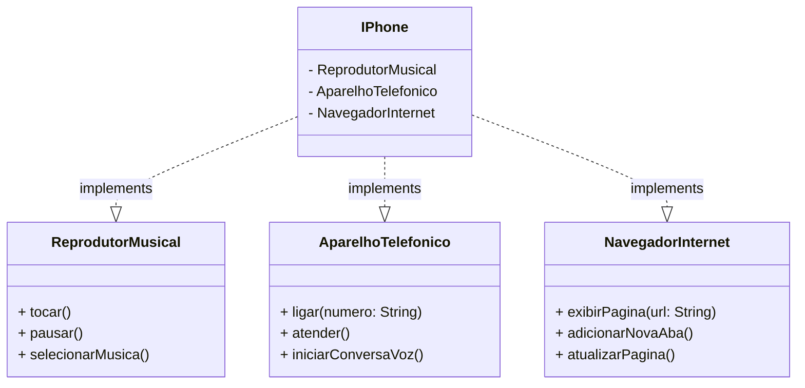

```mermaid
classDiagram
	class IPhone {
		- ReprodutorMusical
		- AparelhoTelefonico
		- NavegadorInternet
	}

	class ReprodutorMusical {
		+ tocar()
		+ pausar()
		+ selecionarMusica()
	}

	class AparelhoTelefonico {
		+ ligar(numero: String)
		+ atender()
		+ iniciarConversaVoz()
	}

	class NavegadorInternet {
		+ exibirPagina(url: String)
		+ adicionarNovaAba()
		+ atualizarPagina()
	}

	IPhone ..|> ReprodutorMusical : implements
	IPhone ..|> AparelhoTelefonico : implements
	IPhone ..|> NavegadorInternet : implements
```