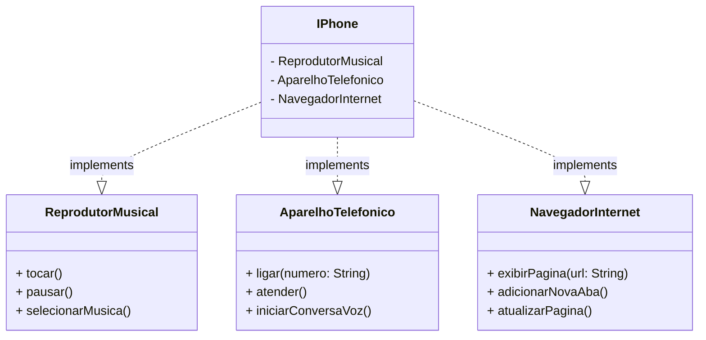

## POO - Desafio

### Modelagem e diagramação da representação em UML e Código no que se refere ao componente iPhone.

<br>

Elabore a diagramação das classes e interfaces com a proposta de representar os papéis do iPhone: 

- Reprodutor Musicial: tocar, pausar, selecionarMusica
- Aparelho Telefônico: ligar, atender, iniciarCorreioVoz
- Navegador na Internet: exibirPagina, adicionarNovaAba, atualizarPagina 

Em seguida crie as classes e interfaces no formato de arquivos ```.java```.


