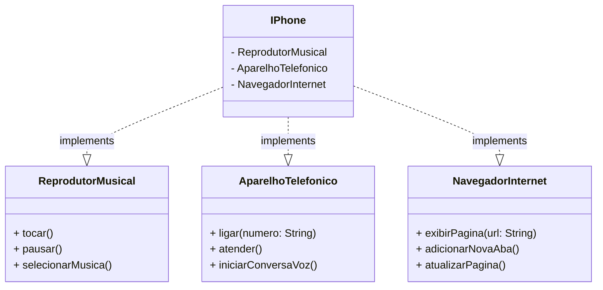

## Desafio de Modelagem e diagramação UML e Código - IPhone.

<br>

Elabore a diagramação das classes e interfaces com a proposta de representar os papéis do iPhone: 

- Reprodutor Musicial: tocar, pausar, selecionarMusica
- Aparelho Telefônico: ligar, atender, iniciarCorreioVoz
- Navegador na Internet: exibirPagina, adicionarNovaAba, atualizarPagina 

Em seguida crie as classes e interfaces no formato de arquivos ```.java```.

<br>

## Diagrama UML




<br>

## 👨‍🎓 Aluno

#### Lucas Araujo

<a href="https://www.linkedin.com/in/lucarauj"></a>

